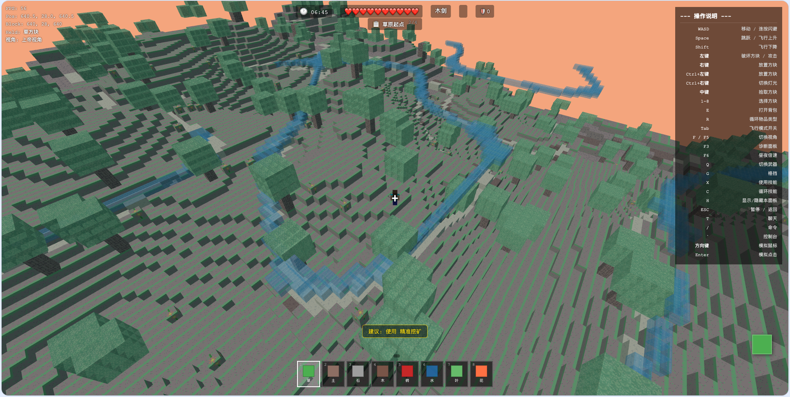
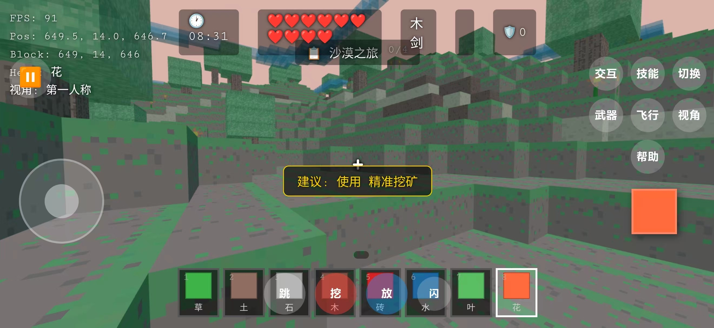

# ⛏️ AICraft — 方块世界

<p align="center">
  <strong>🌍 浏览器中的 3D 体素沙盒世界 | 完全由 AI 自动编写</strong>
</p>

<p align="center">
  
  
</p>

<p align="center">
  <b>Three.js</b> · <b>Vanilla JS</b> · <b>Web Audio API</b> · <b>Claude Code + OpenSpec</b>
</p>

---

**AICraft** 是一款开源的体素沙盒游戏，在你的浏览器中直接运行。

> 🎯 **这不是普通的游戏项目**——从第一行代码到完整的战斗/合成/关卡系统，全部由 **Claude Code + OpenSpec** AI 系统自动编写。作者不会写 JavaScript。

📱 **移动端优先**：完整触摸控制 + 横屏适配，手机打开即玩  
⚔️ **完整玩法**：8 种武器 · 8 种怪物 · 20+ 合成配方 · 6 个关卡  
🎵 **沉浸体验**：程序化 BGM · 15 种音效 · 昼夜循环 · 天气系统  
🔧 **开源协作**：Fork 项目、提 Issue、AI 自动实现你的想法  
📖 [**游戏操作手册**](docs/操作手册.md) · [**技术实现手册**](docs/技术实现手册.md)

## 🎮 在线体验

直接打开 `dist/AICraft.html` 即可游玩，无需安装任何依赖，无需服务器。

```
手机横屏体验更佳！
```

## 📚 文档导读

- [**操作手册**](docs/操作手册.md) — 桌面端/移动端完整操作说明、键盘映射、触控布局、合成配方、武器数据、关卡介绍
- [**技术实现手册**](docs/技术实现手册.md) — 项目架构、核心系统详解（渲染/物理/碰撞/音频/AI）、构建流程、AI 开发工作流

## ✨ 核心特性

### 📱 触摸屏与移动端适配
- 完整的触摸控制方案：虚拟摇杆移动、镜头拖拽、动作按钮
- 自动横屏锁定，自动请求全屏
- 响应式 UI，适配从小屏手机到大屏平板
- 触摸版背包交互（点击拾取 + 点击放置）

### ⚔️ 战斗系统
- 5 种武器：木剑、石剑、铁剑、钻石剑、下界合金剑
- 8 种敌对生物：僵尸、骷髅、蜘蛛、洞穴蜘蛛、苦力怕、末影人、狼、史莱姆
- 格挡（减伤 50%）、闪避（双击方向键）
- 远程弓箭系统（蓄力射击）
- 浮动伤害数字、死亡掉落物品

### 🎵 音乐与音效
- Web Audio API 程序化生成的背景音乐（多层 32 秒循环）
- 15 种音效：破坏、放置、攻击、受伤、拾取、升级、爆炸等
- 支持背景音乐和音效独立音量调节

### 🔧 合成系统
- 2×2 合成网格，拖放操作
- 20+ 合成配方：工具、武器、方块全链条
- 从木头到钻石的完整升级路径

### 🗺️ 关卡系统
- 6 个可选关卡：和平平原、矿山丘陵、风沙荒漠、迷雾沼泽、冰雪苔原、深邃洞穴
- 每个关卡有独立任务和进度追踪
- 关卡切换保留背包和技能

### 🌍 更多特性
- 10 倍大地图（1280 区块），分块加载与 LOD
- 昼夜循环系统（10 分钟完整周期）
- 飞行模式（Tab 切换）
- 4 种视角模式（第一人称 / 第三人称背面 / 第三人称正面 / 上帝视角）
- 5 个可选角色（Steve、铁血战士、暮色法师、矿洞行者等）
- 宠物跟随系统
- 技能系统（探索类技能）
- 世界存档（localStorage 持久化）

## 🤖 关于本项目

### 这完全是 AI 写的！

本项目从第一行代码到所有游戏功能，全部由 **Claude Code**（Anthropic 的 AI 编程助手）配合 **OpenSpec**（AI 驱动的开发流程框架）自动完成。项目作者不会写 JavaScript 代码。

工作流程：
1. 提出需求和想法
2. AI 自动生成设计文档和任务清单
3. AI 自动编写代码实现
4. 构建验证
5. 迭代优化

目前项目已历经 **28 轮变更**，从最基础的核心玩法逐步演进到现在的完整游戏体验。

### 欢迎大家来一起玩

这个项目证明了：**不需要会写代码，也能做出一个完整的游戏**。

- 🐛 **发现 Bug？** 提 Issue 即可，AI 会自动修复
- 💡 **有新想法？** 描述你的需求，AI 会自动实现
- 🔧 **想自己改？** Fork 分支，尽情发挥

### 期望

- 游戏体验继续优化（特别是移动端）
- 更多有趣的关卡和任务
- 更多生物和玩法
- 更好的视觉效果

## 🚀 快速开始

```bash
# 安装依赖（仅构建需要）
npm install

# 构建
node build.js

# 打开构建产物
open dist/AICraft.html
```

## 🏗️ 技术栈

| 技术 | 用途 |
|------|------|
| Three.js (0.160) | 3D 渲染引擎 |
| Vanilla JavaScript | ES Modules 模块化 |
| Web Audio API | 程序化音效与音乐 |
| localStorage | 世界存档持久化 |
| Simplex Noise | 地形生成 |
| BSP 算法 | 地下城生成 |

## 📂 项目结构

```
├── index.html                 # 入口页面
├── main.js                    # 游戏主循环与核心逻辑
├── world.js                   # 世界数据与生成
├── renderer.js                # Three.js 渲染管理
├── player.js                  # 玩家物理与碰撞
├── camera.js                  # 视角控制
├── input.js                   # 键盘/鼠标输入
├── touch-controller.js        # 移动端触摸控制
├── hud.js                     # HUD 界面
├── style.css                  # 样式
├── build.js                   # 构建脚本
├── dist/AICraft.html        # 构建产物（单文件）
├── docs/
│   ├── 操作手册.md            # 游戏操作说明
│   └── 技术实现手册.md         # 架构与技术详解
├── openspec/                  # AI 开发流程文档
│   ├── specs/                 # 能力规格
│   └── templates/             # 文档模板
├── pic/                       # README 截图
└── tests/                     # 自动化测试
```

## 📄 许可

本项目仅供学习和娱乐。

---

**用 AI 改变游戏开发方式 —— 不会写代码？没关系，AI 会。**
